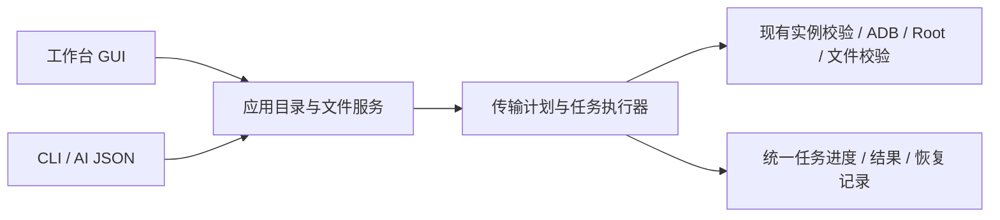

# 通用安卓工作台与双向文件管理设计

日期：2026-09-20。状态：**A1核心去专属化、A2应用目录、B1只读文件目录已实现并有对应证据；完整 A–E 尚未验收**。依据：用户本轮纠偏及 [目标范围](review-remaining-goal.md)，实际进展见 [执行证据](review-remaining-progress.md)。

## 1. 产品边界与本轮决策

产品是通用 Root 安卓虚拟机。应用管理、文件管理、输入、观察、诊断、任务与恢复均不得默认某个游戏。Malody 可以作为实机测试样本，不能成为产品使用前提。

采用最小充分方案：本轮先完成通用化及文件管理；移除默认产品中的 Malody 专属入口和核心实现依赖。既有专用导入逻辑及原始证据保留在版本历史/隔离验收资料中，不删除用户应用、登记或资源。**本轮不以保留 Malody 功能为理由强加插件运行时。** 若以后保留或重新提供该功能，必须按第 6 节实现真正可扩展、独立分发的插件，不能只把原按钮换到“插件”标签页。

设计稿提交于7c5b579，随后开始分批实现，尚未覆盖安装。现有 v0.5.0（30372db）已经安装，GitHub Release 仍是草稿；旧候选不能作为纠偏后的交付。保留现有 tag，不复用同一 tag 或资产名掩盖不同二进制；后续发布需使用可区分的新候选版本并重新验收。

## 2. 现状与可复用部分

| 位置 | 已核实问题 | 处理方向 |
| --- | --- | --- |
| `WorkstationViewModel` | 默认包名及应用名特殊映射；直接调用 `malody.reload` | 统一应用目录服务；无默认游戏；应用选择明确可见 |
| `WorkstationWindow` | 专属皮肤/谱面卡片；全窗口拖放识别 MSP/MCZ；文件页手填包名、单选 | 移除专属 UI；文件页支持一般文件/目录、多选和拖放 |
| `AndroidDebugService` / `SessionSummary` | 通用命令默认 Malody，内置专属页面及续导逻辑 | 显式应用身份；通用摘要只报告有证据的系统状态 |
| `DebugFiles` | 三个固定根；共享根仅 Download；列表静默截取 4096 项；同步文件数 4096、单文件传输 512 MiB 上限 | 发现实际根目录、结构化分页与流式传输；限额显式返回 |
| 文件传输底层 | 已有作用域校验、拒绝越界链接、私有权限处理、暂存/替换备份、散列核验 | 提取为共享服务并补缺口，不重复实现已通过部分 |
| 任务协议 | 已有 requestId/jobId、session、阶段、取消、终态、stdout/stderr 和产物引用 | GUI、CLI 和未来插件统一复用 |

专属导入的“解包完成、启用、游玩”和专属页面名属于应用知识。核心只提供传输核验、进程/Activity、观察证据和扩展状态的承载能力，不把未知业务状态推成成功。

## 3. 面向人的操作

入口有两个：应用页选中应用后点“管理文件”，或直接进入文件页。后者自带应用搜索选择器，不需要先到另一页设置包名。

```text
文件                         实例：当前安卓     用户：主用户
[搜索应用名称或包名… ▼]       图标  应用名称  ·  包名（可复制）

应用目录树                    应用 › 私有数据 › files › documents
  私有数据                    [后退] [上一级] [刷新] [路径] [筛选]
  设备保护数据                □ 名称           类型    大小    修改时间
  外部应用文件                □ documents/     文件夹
  OBB / 媒体（存在时）        □ example.json   文件
共享存储                      … 支持多选、键盘、右键菜单 …
  Download / Documents / …

[上传文件] [上传文件夹] [下载所选] [导出当前目录] [导出应用数据]
任务：3 / 12 项 · 已传 26 MiB · 可取消       [查看结果] [打开电脑目录]
```

- **选择应用**：名称、图标、包名、Android 用户、运行状态来自统一目录服务；搜索名称和包名，系统应用可切换显示。同名应用靠包名/用户区分；拿不到名称或图标时显示真实包名和占位图，不编造名称。只记忆同一实例的选择；应用卸载或实例变化后清空失效选择。无需把“列表第一项”当作用户选择。
- **选择位置**：私有数据、设备保护数据、外部数据、OBB、媒体按实际存在/可访问情况呈现；共享存储独立于应用选择。私有根按 Android 用户发现，不固定 `/data/data` 别名。显示锁定、缺失、不可访问的具体原因。
- **浏览**：目录树、面包屑、上级/后退、可复制地址、多选；地址框供熟练用户使用，不是主路径。显示原始安卓路径，但操作始终使用后台解析出的根和条目。分页/继续加载有明确标识，不能默默漏掉后续条目。
- **双向传输**：任意所选普通文件或文件夹均可从安卓下载到电脑，也可从电脑上传到当前目录；保留相对层级及空目录。多个文件/文件夹可一起选择或拖入。文件页收到 APK 也按普通文件上传；应用安装仅由应用页或明确“安装”动作触发。
- **两个导出入口**：“下载所选 / 导出当前目录”导出实际所选内容；“导出应用数据”选择一个或多个应用根，包含私有数据，附根、相对路径、哈希、权限和一致性清单。默认导出为电脑可浏览的目录；不能原样落地到 Windows 的名称或链接提供归档选项，不静默丢文件或改名。
- **覆盖处理**：没有冲突直接执行；有冲突才展示新增/相同/同名不同内容/类型冲突，并提供跳过、保留双方、备份后覆盖。目录上传默认合并，不自动删除目标多余文件。镜像删除不属于本轮。
- **运行中的私有数据**：一致性导出、私有写入的计划标出需要停止哪些应用；GUI 使用“停止应用并导出/上传”按钮表达该动作，CLI 用显式参数。仅要求停止所选应用，不关闭整个虚拟机或宿主程序。运行中读取可作为高级选项，但结果必须标为一致性未验证，不能当作可靠备份。默认不在结束后擅自重新启动应用。
- **结果**：逐项列成功、跳过、失败及可恢复内容，提供错误定位、重试失败项、打开本地目录；取消后保留已完成项的真实状态。传输散列一致不等于应用实际读取或业务导入成功。

“任意应用文件”指不按包名、扩展名或应用类别设白名单，覆盖应用可发现的数据根内任意层级。共享目录可独立浏览。特殊套接字、设备节点、只读系统镜像、未解锁数据不虚称可复制；返回具体不支持/不可访问原因。本轮不为这个需求加入系统分区任意改写。

## 4. GUI 与 AI 共用的契约



以下是接口设计；当前已实现`apps.list/apps.resolve/users.list/files.roots/files.browse/files.stat`，传输计划与执行仍待实现。继续使用已有请求外壳及任务协议，命令通过 `capabilities` / `schema` 自描述。

| 命令 | 输入与结果 |
| --- | --- |
| `apps.list` | 查询词、用户、是否包含系统应用、游标；返回 `appRef`、真实名称、包名、用户、版本、可选图标产物、运行状态与分页信息 |
| `files.roots` | `appRef` 或共享存储请求；返回 `rootRef`、用途、显示路径、存在/锁定/读写能力和原因 |
| `files.browse` | `rootRef + relativePath` 或目录 `entryRef`、游标；返回结构化条目、类型/大小/修改时间/权限、`entryRef` 和下一页游标 |
| `files.stat` | `entryRef`；返回当前身份/元数据，按需计算哈希，不让每次列表都散列全部文件 |
| `files.transfer.plan` | 下载的条目集合/根，或上传的电脑路径集合及目标目录；返回计划 ID、冲突、空间需求、停应用要求和逐项决策 |
| `files.transfer.start` | `planId`、显式冲突策略、是否停止目标应用、幂等键；返回现有 `jobId`，使用现有任务查询和取消机制 |

`appRef` 绑定持久实例 ID、Android 用户和应用身份；卸载重装后须重新解析安装身份。`rootRef`、`entryRef` 和传输计划还绑定观察到的 VM 会话及路径版本，不能拿旧引用操作新实例。引用是结构化定位方式，不是绕过权限检查的凭证。

AI 操作流程：

1. `apps.list` 搜索用户给出的应用名称，得到真实 `appRef`；多个结果时按包名/用户消歧，不能猜包名。
2. `files.roots` 列出位置，再用 `files.browse` 逐层选择文件/目录；也可直接使用 `rootRef + relativePath`，便于脚本。
3. `files.transfer.plan` 给出可执行计划；无冲突时无需通过 GUI。遇到冲突或停应用要求，调用者明确提供策略。
4. `files.transfer.start` 后按 `jobId` 等待/取消；只读结果中的逐项状态及产物引用，无需解析中文提示或操作 GUI。

示例请求（占位引用由上一步实际返回值替换）：

```json
{
  "schemaVersion": 1,
  "command": "files.transfer.plan",
  "arguments": {
    "direction": "download",
    "sources": [{"entryRef": "entry-from-browse"}],
    "destination": {"localDirectory": "D:\\Exports\\SelectedApp"},
    "consistency": "stopped-app"
  }
}
```

上传采用 `sources: [{"localPath": "D:\\Imports\\documents"}]`、`destination: {"entryRef": "directory-from-browse"}`；方向为 `upload`。从电脑选中的顶层文件夹默认保留其名称；“仅上传其中内容”是另一个显式选项，不靠斜杠猜测。根目录导出以根的显示名称分层，避免不同根互相覆盖。

计划只收集元数据/核验依据，不停止应用、不写目标内容。执行前重新检查实例、应用安装身份、源变化、目标冲突及空间；变化时返回 `plan_stale` 和具体原因，不执行过时覆盖。幂等键绑定计划及执行参数；重复请求返回原任务，不能再启动一遍写入。

错误码至少区分：`app_not_found`、`app_ambiguous`、`root_unavailable`、`data_locked`、`stale_reference`、`plan_stale`、`conflict`、`insufficient_space`、`source_changed`、`checksum_mismatch`、`unsupported_entry`。均带阶段、受影响条目及可重试条件。批次内有失败时，任务不能整体标为成功；结果保留已完成项和待恢复项。

兼容策略：旧 `apps` 保持包名数组，新 `apps.list` 返回结构化清单；旧 `files.*` 显式 package/scope 请求由适配层转入共享服务，保留已承诺的旧字段。缺少应用参数的应用专属操作返回 `app_required`，不能继续暗选 Malody；共享操作无需虚构包名。`session.summary` 无应用选择时返回实例摘要。旧专属命令停止在核心提供，迁移说明列明替代路径；历史任务可查看，不将不可用命令伪装成可续作。

## 5. 传输实现边界

- 应用目录由单一后端查询 Android 包管理元数据并缓存；名称/图标按用户、包、版本、语言失效。具体元数据适配实现先以本机现有工具做小样验证，不靠维护应用名称表，不更换系统镜像。
- 根目录发现统一处理用户、CE/DE 私有目录、外部数据、媒体/OBB 和共享卷；当前设备不具备的能力显式返回。应用卸载、数据锁定、目录尚未生成均是可区分状态。
- 目录条目使用类型化 DTO，不再要求 GUI/AI 分割 `stat` 拼接字符串。批量读取目录元数据，避免逐文件一次 ADB 往返；分页不可静默截断，目录变化导致游标失效时提示刷新。
- 复用已有根目录包含性、重解析点/符号链接防越界、私有 UID/GID、mode、restorecon 和暂存校验。上传后的权限适合目标应用，不能统一 chmod 777，也不能以 root 能读代替应用能读。
- 将单文件与目录传输纳入同一计划、逐项账本及哈希清单。流式传输避免整文件读进内存；可恢复时核验源身份与暂存块，已核验完成的文件无需重传。不承诺目录操作天然全有或全无：取消时报告哪些已提交、哪些仍暂存以及如何回退。
- 替换保留可定位备份；写入或最终核验失败保留原文件/可恢复记录。VM/broker 重连后不自动重放写入，重新绑定同一持久实例并检查源/目标后才能续作。
- Windows 不支持的名称、大小写冲突、链接、文件/目录同名冲突在计划阶段列出。普通目录模式不能静默折叠；需要原样保存时使用带清单的归档。稀疏文件按逻辑大小评估，所有限额通过能力接口暴露，超限给出可分批处理的明确信息。
- 私有导出本地文件采用受限访问权限；诊断默认只引用产物，不将用户文件内容混进普通日志。清理失败明确列出暂存位置，不假报完全成功。
- “导出应用数据”是文件级导出。涉及系统密钥、账号或应用内部迁移的可运行性另需应用实际验证，不因文件齐全就声称跨设备完整还原。

## 6. 保留专用能力时的插件契约（后续可选范围）

最小插件应具备以下能力；未实现前不宣称产品“支持插件”：

1. 独立插件包及 manifest：插件 ID、版本、宿主协议范围、名称、适用应用条件、命令参数/结果 schema、菜单动作、所需能力。
2. 插件管理页：从本地安装、查看来源/版本、启用、禁用、卸载；启停与卸载不删除应用数据。默认通用安装不携带游戏插件。
3. 独立执行进程通过有版本的 JSON IPC 使用宿主 API；动作沿用 requestId/jobId、进度、取消、证据和恢复契约。核心按命令命名空间路由，不能新增 `if (package == 某游戏)` 分支。
4. 可声明应用动作、文件格式处理、页面观察/业务核验；由通用表单或动作卡片呈现，GUI 和 AI 都能发现同一命令。文件拖放默认仍是普通传输，插件接管必须是明确动作。
5. 插件运行失败/超时不得崩溃核心；禁用后新任务不可调用，运行中的任务按协议取消并记清理结果。版本不兼容拒绝加载；缺插件的历史任务保留可读证据及不可续作原因。
6. 首版只支持用户主动安装的可信本地扩展。独立进程用于故障隔离，**不声称提供恶意插件安全沙箱**；不做插件市场、任意远程脚本或自动安装。

如果制作 Malody 插件，包名、MSP/MCZ、元数据重写规则、页面枚举、导入/激活流程均进入插件包；核心只提供应用、文件、Intent、观察、输入和任务 API。旧 `malody.*` 的兼容别名也由该插件注册。至少用第二个无关示例插件验证“无需修改核心即可扩展”，才能验收可扩展性。

## 7. 分批实现与验收

以下各批次的**整体验收仍待完成**，A1局部离线结果见执行证据；既有 Malody 测试和 295 项旧回归不能替代：

| 批次 | 交付 | 必须提交的验收证据 |
| --- | --- | --- |
| A 通用化与应用发现 | 去专属 UI/默认包名/核心逻辑，结构化应用选择与摘要 | 未安装 Malody 的环境可完成核心流程；至少两个无关应用（含非游戏）；名称/图标/同名消歧及元数据缺失回退；无选中应用不误操作 |
| B 双向文件服务 | 根发现、分页、多选计划、文件/目录传输与兼容适配 | 两应用的私有/外部及共享嵌套文件双向传输；空目录、中文/空格、4096 项以上分页、超过旧 512 MiB 限制的流式传输；原始散列和逐项清单；新建/替换后由应用实际读取 |
| C 人与 AI 同等能力 | 文件工作台、拖放、冲突/进度/结果、schema/CLI 文档 | GUI 不输入包名完成私有文件夹导出与电脑目录上传；CLI 不依赖 GUI 状态完成同一流程；结果/错误/产物一致；键盘、多选及可访问性入口验证 |
| D 一致性与恢复 | 停应用计划、冲突备份、失败/取消/续作 | 活跃应用数据导出边界、并发源变更、覆盖回退、类型/名称冲突、链接越界、空间不足、取消/断线/会话变化；不串实例、不自动重放、不虚报全批成功 |
| E 交付 | 新候选、备份覆盖安装、装后回归和发布 | 旧正式数据保持；安装散列；已安装版本复验 A–D 关键路径；受影响的既有通用输入/任务/恢复回归；逐项标明通过与未验证 |

插件为单独可选批次；若决定保留专用能力，其 manifest/生命周期、第二插件扩展、禁用/故障隔离、GUI/CLI 能力一致性全部通过后才能交付。不能用隐藏原按钮代替通用化，也不能把插件列为已完成。

维持原约束：启动可用内存门槛 2560 MiB；不重开 2 GB 目标，不改其他现有内存配置、系统镜像或显卡驱动，不修改正式游戏资源。测试使用隔离数据；不通过耗尽宿主空间或内存制造失败。
